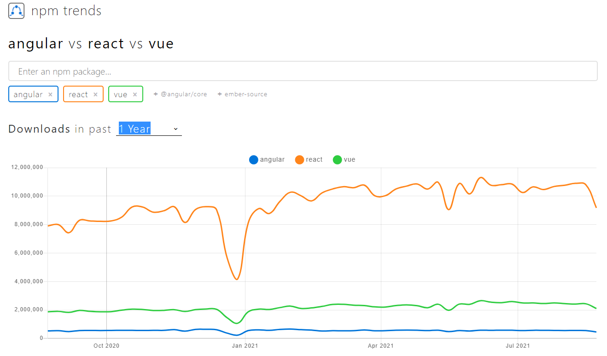
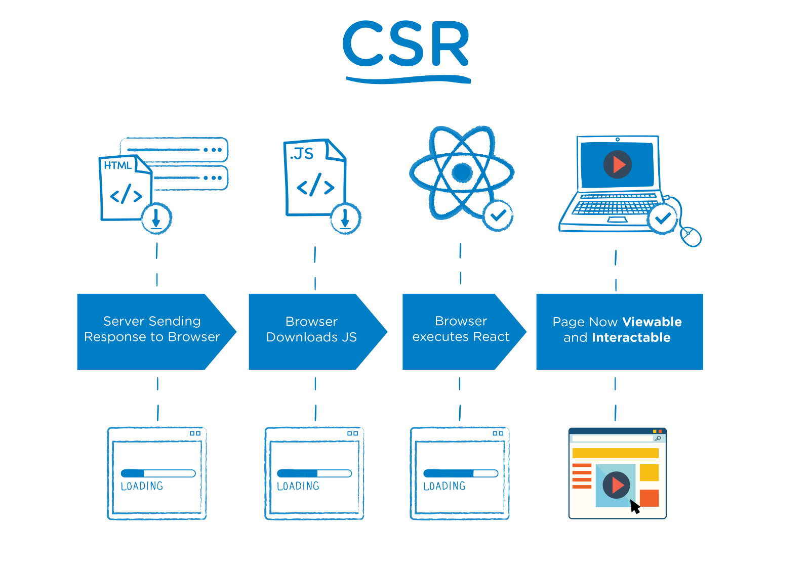
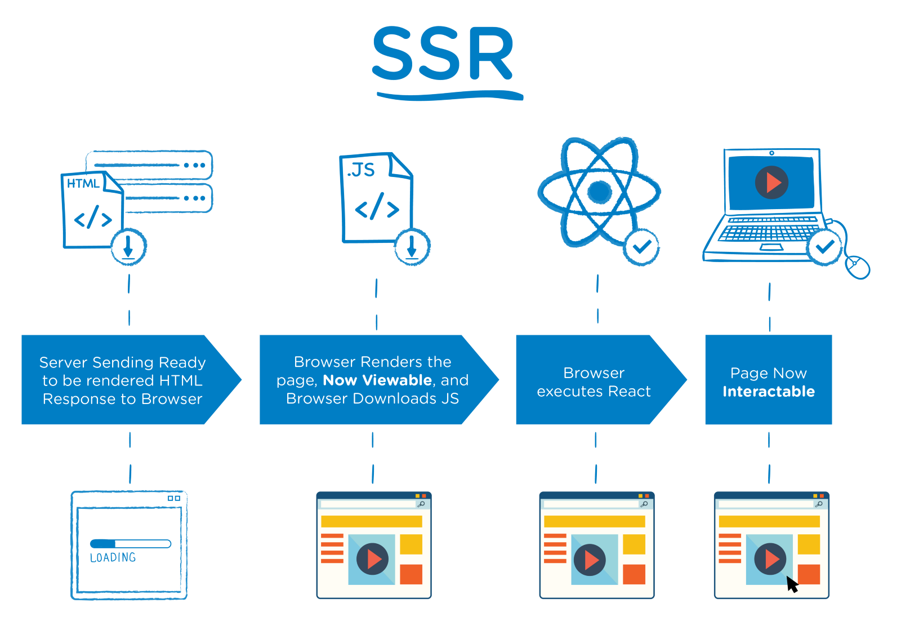

# React.js
React.js에 대하여 공부해보자!
# Angular vs Vue vs React  

1년간 다운로드 수 비교



```
Angular 
  - Develop Across All Platforms
  - 어떤 플랫폼이든 하나의 코드베이스로 결과물을 낼 수 있도록 도와준다.
  - Web에 필요한 전반적인 모든 기능을 제공하는 형태로 구성이 된다.
  - full framework 지향

Vue
  - Progressive JavaScript Framework
  - Vue를 Angular같은 혹은 React같은 방식을 선택해서 사용한다.
  - framework 처럼도 library 처럼도 사용 가능

React
 - A JavaScript library for building user interfaces
 - user interfaces를 표현하고 동작시켰을때 변화하는것에 초점을 맞췄다.
 - library 지향
```

# Component?

```HTML
<!-- HTMLElement -->

<button class="클래스 이름">버튼</button>
```

```Javascript
// Component
<이름1 name="bigzzang" />
<이름 prop={false}>내용</이름>
```

```
- src, class, name, props 밖에서 넣어주는 데이터
- 문서(HTML), 스타일(CSS), 동작(JS)를 합쳐서 내가 만든 일종의 태그
```

# Component Based Development
- Version
  - Links
  - Title
  - Content
     - Card
     - Card
     - Card

독립적인 코드 블럭 (HTML + CSS + JavaScript)    
리액트는 이러한 Component들의 결합을 기반으로 개발을 한다

# Virtual DOM
DOM을 직접 제어하는 경우 (ex. JQuery)
 - 바뀐 부분만 정확히 바꿔야 한다.

DOM을 직접 제어하지 않는 경우
- 가상의 돔 트리를 사용해서 이전 사태와 이후 상태를 비교하여 바뀐 부분을 찾아내서 자동으로 바꾼다.

# CSR & SSR



- JS가 전부 다운로드 되어 리액트 애플리케이션이 정상 실행되기 전까지는 화면이 보이지 않음
- JS가 전부 다운로드 되어 리액트 애플리케이션이 정상 실행된 후, 화면이 보이면서 유저가 인터렉션 가능

<br />



- JS가 전부 다운로드 되지 않아도, 일단 화면은 보이지만 유저가 사용 할 수 없음
- JS가 전부 다운로드 되어 리액트 애플리케이션이 정상 실행된 후, 유저가 사용 가능

# 개발 환경
- Node.js
- Browser
- Git
- VSCode

# React Library
리액트의 핵심 모듈
- react-dom
- react

```javascript
// 1. 리액트 컴포넌트 => HTMLElement 연결하기
import ReactDOM from 'react-dom';

// 2. 리액트 컴포넌트 만들기
import React from 'react';
```


보통 node.js에서 모듈을 가져다 쓰려면 require를 이용한다.

import는 es6 모듈 방식으로 react를 사용할때 import를 사용할 수 있는 이유는 import를 이용한 구문들이 webpack을 통해서 변경이 되기 때문에 사용할 수 있다.

보통 js에서 라이브러리는 script를 추가해서 전역객체를 끌어다가 사용한다. 

import로 모듈을 모듈화 시켜서 사용 하는 것은 js만으로 해결되지 않아 webpack과 같은 bundler를 사용하게 된다.

## ReactDOM.render
---
"만들어진 리액트 컴포넌트"를 실제 HTMLElemnet에 연결할 때 ReactDOM 라이브러리를 이용한다.

## Use React, ReactDOM Library with CDN
---
https://ko.reactjs.org/docs/cdn-links.html  
cdn을 통해 library를 가져와서 작업을 진행할 수 있다.

## 기존 프론트엔드
---
1. HTML로 문서 구조를 잡고
2. CSS로 스타일을 입히고
3. JavaScript로 DOM을 조작한다.

## 컴포넌트를 활용한 프론트엔드
---
- 컴포넌트를 정의하고 실제 DOM에 컴포넌트를 그려준다.