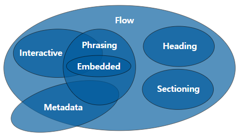

# HTML이란?
<br />

# 1. HTML은 어떻게 생겼을까

- 웹 페이지를 구성하고 있는 요소(element) 하나하나를 "태그"라는 표기법을 작성
- 태그를 통해 어떤요소인지(제목, 본문, 이미지, 비디오 등) 명시
- 태그의 이름은 HTML5 웹 표준에 맞게 작성
```HTML
<p>내용</p>

1. 여는 태그(Opening tag): <요소의 이름>
2. 닫는 태그(Closing tag): </요소의 이름>
3. 내용(Content): 요소의 내용
4. 요소(Element): 여는 태그, 닫는 태그, 내용을 통틀어 요소(element)라고 한다.
```

- 태그의 경우 대소문자를 구분하진 않지만, HTML5에서는 모두 소문자로 작성하는 것을 권장

# 2. 빈 요소(Empty elements)

- 내용(content)이 없다면 -> 이미지, 수평선, 줄바꿈 등
- 내용이 없는 요소를 빈 요소(Empty elements)라 부른다.
- 이 경우 닫는 태그를 추가로 명시하지 않아도 된다.
- Empty element, Self-Closing element, Void element, Single tag...

```html
<br>
<hr>

<meta charset="utf-8">
<input type="text" name="name">
```

- HTML5에서 빈 요소 뒤에 슬래시(/)를 붙이는건 자유
- 통일성을 가지고 코드를 작성하는게 중요

# 3. 요소의 중첩

- 요소 안에 다른 요소가 들어가는 포함관계를 성립할 수 있다.
- 여러 요소가 중첩될 경우에는, 열린 순서의 반대로 닫혀야만 한다.
- 서로의 포함관계(부자관계)를 구분하기 위하여 들여쓰기를 사용한다

```html
<html>
  <head>
    <title>요소의 중첩</title>
  </head>
  <body>
    <h1>요소안에 <strong>다른 요소가</strong> 들어갈 수 있다</h1>
    <ul>
      <li>01</li>
      <li>02</li>
      <li>03</li>
    </ul>
  </body>
</html>
```

# 4. 주석

- 브라우저는 주석을 무시하여 사용자가 주석을 보이지 않게 한다.
- 주석의 목적은 코드에 메모를 추가하거나, 혹은 사용하지 않는 코드를 임시로 처리하기 위함이다.
- 동료 개발자와의 소통을 위하여, 코드의 설명을 위하여 작성
- 정말 필요한 위치에 작성, 남발하지 않기

```html
<!-- 메모 주석 -->
<!-- <p>코드 주석</p> -->
```

# 5. HTML 문서의 구조

```html
<!DOCTYPE html>
<html >
  <head>
    <!-- HEAD 영역 -->
  </head>
  <body>
    <!-- BODY 영역 -->
  </body>
</html>
```

- !DOCTYPE html : HTML5 이전에는 버전을 명시했지만 HTML5가 표준화가 되고 대부분의 브라우저들이 웹표준을 준수하고 있기에 html만 작성해도 된다.  
생략 해도 되지만 관습화 되어서 작성한다.
- html : 페이지 전체의 컨텐츠를 감싸는 루트(root) 요소
  - head : 웹브라우저 화면에 직접적으로 나타나진 않는 웹페이지의 정보
    - meta tag : 문서의 일반적인 정보와 문자 인코딩을 명시
    - title : 웹브라우저의 제목 표시줄이나 페이지 탭에 보이는 문서 제목
  - body : 웹브라우저 화면에 나타나는 모든 컨텐츠

# 6. MDN

- 궁금한 것을 찾고 싶을때 개인 블로그 같은 것들 보다 MDN문서를 참고하는 것이 신뢰성이 높다

# 7. HEAD 태그

- head 요소는 기계(웹브라우저)가 식별할 수 있는 문서 정보(메타데이터)를 담는다.
- 정보로는 제목, 스크립트, 스타일 시트 등이 있다.
- head의 주 목적은 기계 처리를 위한 정보이고, 사람이 읽을 수 있는 정보가 아니다.
- head태그는 문법적으로는 생략할 수 있지만 생략하지 말자

# 8. BODY 태그

- body 요소는 HTML 문서의 내용을 나타낸다
- 한 문서에 하나의 body 요소만 존재할 수 있다.
- body태그는 문법적으로는 생략할 수 있지만 생략하지 말자

# 9. 태그를 구분짓는 특성

1. 구획을 나누는 태그
    - 단독으로 사용했을 때에는 눈에 보이지않는다.
    - 여러가지 요소들을 묶어서 그룹화
    - ex) header, section, footer...  
<br />

2. 그 자체로 요소인 태그
    - 단독으로 사용했을 때에도 눈으로 확인할 수 있다.
    - ex) button, text...

# 10. 블록과 인라인

1. 블록(Block)
    - 블록 레벨 요소는 언제나 새로운 줄에서 시작하고, 좌우 양쪽으로 최대한 늘어나 가능한 모든 너비를 차지한다.
    - 상자를 아래로 쌓는 것  
<br />

2. 인라인(Inline)
    - 인라인 요소는 줄의 어느 곳에서나 시작할 수 있다.
    - 바로 이전 요소가 끝나는 지점부터 시작하여, 요소의 내용(content)만큼만 차지한다.  
<br />

- 포함 규칙
  - 같은 형태의 다른 요소를 안에 포함할 수 있다.  
    (블록> 블록, 인라인 > 인라인)
  - 대부분의 블록 요소는 다른 인라인 요소도 안에 포함할 수 있다.
  - 인라인 요소는 블록 요소를 포함 할 수 없다.

# 11. 콘텐츠 카테고리

- HTML5 부터 비슷한 특징을 가진 요소끼리 묶어서 7가지 카테고리로 세분화
- 하나의 HTML 요소가 여러 콘텐츠 카테고리 내의 포함관계에 들어갈 수도 있다.



제목 | 내용
--|--
메타데이터 콘텐츠 (Metadata Content) | 문서의 메타 데이터(정보), 다른 문서를 가리키는 링크 등을 나타내는 요소
플로우 콘텐츠 (Flow Content) | 웹 페이지상에 메타데이터를 제외하고 거의 모든 요소. 보통 텍스트나 임베디드 콘텐츠를 포함
섹션 콘텐츠 (Section Content) | 웹 문서의 구획(Section)을 나눌 때 사용
헤딩 콘텐츠 (Heading Content) | 섹션의 제목(heading)과 관련된 요소
프레이징 콘텐츠 (Phrasing Content) | 문단에서 텍스트를 마크업 할 때 사용
임베디드 콘텐츠 (Embedded Content) | 이미지나 비디오 등 외부 소스를 가져오거나 삽입할 때 사용되는 요소
인터랙티브 콘텐츠 (Interactive Content) | 사용자와의 상호작용을 위한 컨턴츠 요소

# 메타데이터 요소
<br />

# 1. 메타데이터의 역할

- 데이터를 설명하는 데이터

# 2. title

- title 요소는 브라우저의 제목 표시줄이나 페이지 탭에 보이는 문서 제목을 정의한다.
- 텍스트만 포함할 수 있으며 태그를 포함하더라도 무시한다.
- 검색엔진이 결과 페이지의 순서를 결정하는 구성 요소중 하나가 페이지 제목의 내용이다.

# 3. meta - 문서 정보

- meta 요소는 base, link, script, style, title 과 같은 다른 메타관련 요소로 나타낼 수 없는 메타데이터를 나타낸다.
- 빈 요소이기에 가능한 콘텐츠가 없다.
- name과 content 특성을 함께 사용하면 문서의 메타데이터를 이름-값 쌍으로 제공할 수 있다.
- 필수는 아니지만 검색엔진이 정보를 수집하는 측면에서 작성하면 좋다.  
<br />

### HTML 명세가 정의하는 표준 메타데이터 이름

- application-name 
  - 웹 페이지에서 구동 중인 애플리케이션의 이름
- author 
  - 문서 저작자
- description
  - 페이지에 대한 짧고 정확한 요약
- generator
  - 페이지를 생성한 소프트웨어의 식별자
- keywords
  - 페이지의 콘텐츠와 관련된, 쉼표로 구분한 키워드 목록으로 인스타그램의 해시태그와 비슷하다.

# 4. meta - 문자 인코딩, 뷰포트

- charset
  - 페이지의 문자 인코딩을 선언
  - head의 첫번째 줄이나 title 전에 넣어주는 것을 권장
- viewport
  - 뷰포트의 초기 사이즈에 대한 힌트
  - 모바일 장치에서만 사용한다.

# 5. MIME 타입

- MIME 타입이란 클라이언트에게 전송된 문서의 다양성을 알려주기 위한 메커니즘이다.
- 수 많은 종류의 문서가 있으므로 많은 MIME 타입들이 존재한다.

일반적인 구조

> type/subtype

개별 타입

>text/plain  
>text/html  
>image/jpeg  
>image/png  
>audio/mpeg  
>audio/ogg  
>audio/*  
>video/mp4  
>application/octet-stream  
>…

- 외우기 보다는 그때그때 찾아쓰자

# 6. style

- style 요소는 문서나 문서 일부에 대한 스타일 정보를 포함한다.

- style 요소는 문서의 head 안에 위치해야 한다. 그러나, 일반적으로 스타일은 외부 스타일 시트에 작성하고, link 요소로 연결하는 편이 좋다.

# 7. script

- script 요소는 데이터와 실행 가능한 코드를 문서에 포함할 때 사용하며 보통 JavaScript 코드와 함께 쓴다.

- script 요소를 사용해 외부 스크립트를 가져오는 예시

  ```html
  <script src="javascript.js"></script>
  ```

- script 요소 내부에 인라인 스크립트를 작성하는 예시

  ```html
  <script>
    alert("Hello World!");
  </script>
  ```


