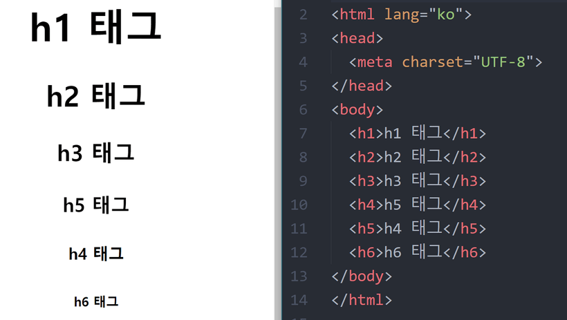
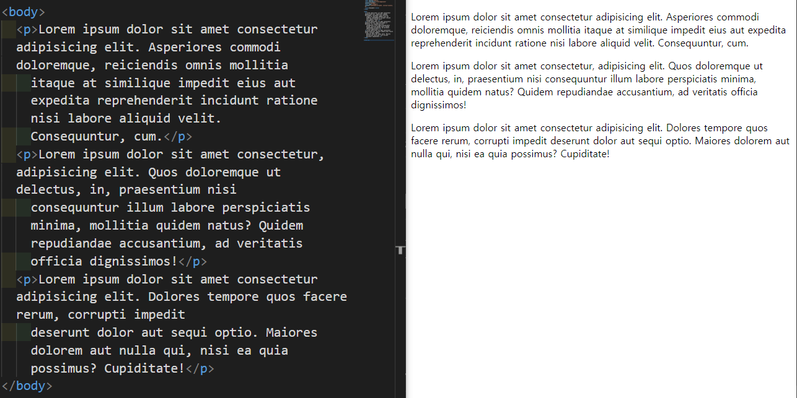
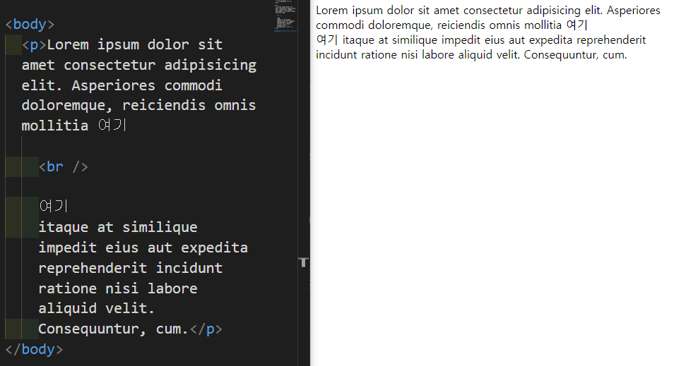
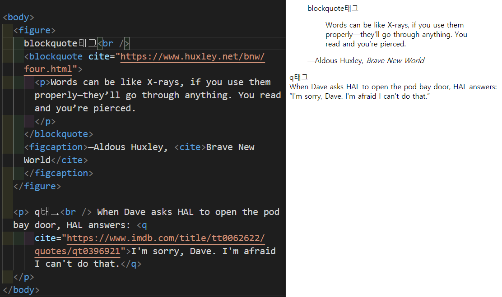
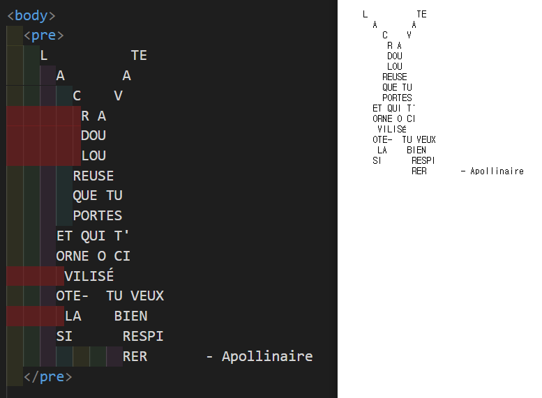
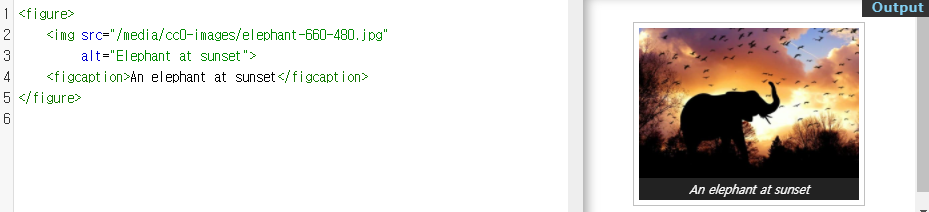
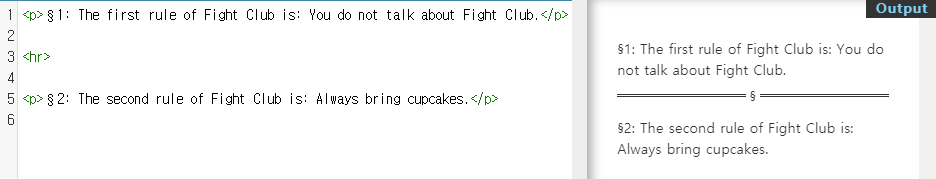

# 텍스트 요소

## 1. 제목 - h1 ~ h6



- heading -> h
- h1 ~ h6는 6단계의 구획 제목을 나타낸다. 
- 단계는 h1이 가장 높고 h6이 가장 낮다.
- 사용자 에이전트가 제목의 정보를 사용해 자동으로 문서 콘텐츠의 표를 만드는 등의 작업을 수행할 수 있다.
- 글씨 크기를 위해서는 CSS의 font-size 속성을 사용해야한다.
- h1으로 시작해서 순차적으로 사용해야한다.
- 페이지 당 하나의 h1만 사용하는걸 권장한다.

## 2. 본문 - p 



- paragraph -> p
- p태그는 하나의 문단을 나타낸다.
- HTML에서 문단은 이미지나 입력 폼 등 서로 관련있는 콘텐츠 무엇이나 될 수 있다.
- 블록 레벨 요소이며, 자신의 닫는 태그 이전에 다른 블록 레벨 태그가 분석되면 자동으로 닫힌다.
- 기본 스타일은 문단끼리 한 줄의 간격으로 분리한다.
- 첫 줄 들여쓰기 등 다른 구분 방법은 CSS를 통해 사용할 수 있다.
- 빈 p태그를 사용해 문단 사이에 여백을 추가하면 스크린 리더 사용자에게 부정적인 경험을 줄 수 있다.
- 여분의 공간이 필요하다면 margin 등 CSS 속성을 통해 적용하자.

## 3. 본문 - br



- line break -> br
- br태그는 빈 요소로 텍스트 안에 줄바꿈을 생성한다.
- 문단 사이에 여백을 두기 위한 용도로 사용하면 안된다. 대신 p태그로 감싼 후 CSS의 margin 속성으로 여백의 크기를 조절하자.
- br태그에 margin을 적용하면 줄 간격을 늘릴 수 있겠지만 좋은 방법은 아니다. 이런 목적을 위해서는 CSS line-height 속성을 사용하자.
- 문단 구분을 br로 하면 안된다.

## 4. 본문 - blockquote, q



- blockquote : 인용 블록 요소, 긴 인용문
- q : 인라인 인용문 요소, 짧은 인라인 인용
- cite : 인용문의 출처 문서나 메시지를 가리키는 URL

## 5. 본문 - pre



- preformatted -> pre
- 미리 서식을 지정한 텍스트로 HTML에 작성한 내용 그대로 표현한다.
- 텍스트는 고정폭 글꼴을 사용해 렌더링하고, 요소내 공백문자를 그대로 유지한다.

## 6. 본문 - figure, figcaption



- figure태그는 독립적인 콘텐츠를 표현한다
- figcaption태그를 사용해 설명을 붙일 수 있다.

## 7. 본문 - hr



- horizontal rule -> hr
- 문단과 문단사이를 나누는 수평선
- 빈 요소이다.

## 8. 본문 - abbr, address, cite, bdo

- abbreviation -> abbr : 약어
  - title 속성을 사용해서 설명을 하고 약어에 마우스를 올리면 툴팁으로 설명이 나온다.
- address : 주소
  - 과거 오프라인 주소를 나타내는데 많이 사용
- cite : 인용의 출처
- bidirectional override -> bdo : 문장을 반대로 읽는다. 

  ```html
    <bdo dir="rtl">ABCDEFG</bdo>
    => GFEDCBA로 나오게 된다.
  ```

## 9. 포매팅 - b, strong

- b태그와 strong태그 둘 다 bold체를 만들어준다.
- b태그
  - 요약 키워드, 리뷰의 제품명 등 특별한 중요성을 가지고 있지 않지만 굵게 표시할 부분에 사용한다.
  - 스타일링적인 부분으로 사용하면 안된다. CSS font-weight를 사용하자.
- strong태그
  - 높은 중요도를 가지고 있는 부분에 사용한다.

## 10. 포매팅 - i, em

- i태그와 em태그 둘 다 기울임꼴로 표시한다.
- i태그
  - 주위와 구분해야하는 부분을 나타낸다.
  - 기술 용어, 외국어 구절, 등장인물의 생각 등
- em태그
  - 텍스트의 강세를 나타낸다.
  - 중첩하면 더 큰 강세를 나타낸다.

## 11. 포매팅 - mark, small, sub, sup

- mark태그
  - 하이라이팅을 해준다.
- small태그
  - 덧붙이는 글이나, 저작권과 법률 표기 등의 작은텍스트를 나타낸다.
- sub태그
  - 아래 첨자 요소
  - 각주, 수식, 화학식 같은것들을 표기할때 사용
- sup태그
  - 위 첨자 요소
  - 지수와 같은것들을 표기할때 사용

## 12. 포매팅 - del, ins, code, kbd

- del태그
  - 문서에서 제거된 텍스트의 범위를 나타낸다.
- ins태그
  - 문서에서 추가된 텍스트의 범위를 나타낸다.
- code태그
  - pre태그와 비슷하지만 인라인 요소이다.
  - 문장의 흐름에 단어를 짧게 넣고 싶을때 사용한다.
- kbd태그
  - 키보드 입력 요소

## 13. a태그와 하이퍼링크
  
- a태그
  - href 특성을 통해 다른 페이지나 같은 페이지의 어느 위치, 파일, 이메일 주소와 그 외 다른 URL로 연결할 수 있는 하이퍼링크를 만든다.
- href
  - 하이퍼링크가 가리키는 URL 링크는 HTTP 기반 URL일 필요는 없다.
- target
  - _self
    - 기본 값으로 현재 브라우저에서 열린다.
  - _blank
    - 새탭에서 열린다.

## 14. 엔티티(Entity)
- 예약어를 텍스트 그대로 사용하고 싶을때 사용한다.

Literal character | Character reference equivalent
:--:|:--
&lt; | & l t ;
&gt; | & g t ;
&quot; | & q u o t ;
&apos; | & a p o s ;
&amp; | & a m p ;
spaceing | & n b s p ;

# 구조를 나타내는 요소

## 1. 컨테이너 (div, span)

- div태그
  - 플로우 콘텐츠를 위한 통용 컨테이너이다.
  - 특정구역이나 구획을 분할하거나 묶을때 사용한다.
  - 순수 컨테이너로서 아무것도 표현하지 않는다.
  - 대신 다른 요소 여럿을 묶어 class나 id속성으로 꾸미기 쉽게 돕는다.
  - CSS로 꾸미기 전에는 콘텐츠나 레이아웃에 어떤 영향도 주지 않는다.
  - 전역 특성만 포함한다.
- span태그
  - 구문 콘텐츠를 위한 통용 인라인 컨테이너이다,
  - 본질적으로 아무것도 나타내지 않는다.
  - 전역 특성만 포함한다.
- div태그는 블록 요소이고 span태그는 인라인 요소이다.

## 2. 시멘틱 웹이란

- Semantic : 의미의, 의미론적인
- 요소의 의미를 고려하여, 구조를 설계하고 코드를 작성한다.
- 의미론적인 마크업을 사용하면 얻는 이점
  - 검색엔진은 의미론적인 마크업을 분석하여 페이지의 검색 랭킹에 영향을 줄 수 있는 중요한 키워드로 간주한다.
  - 시각 장애가 있는 사용자가 스크린리더로 페이지를 탐색할 때 의미론적 마크업을 푯말로 사용할 수 있다.
  - 의미가 없는 끊임없는 div들을 탐색하는 것보다, 의미있는 코드 블록을 찾는 것이 훨씬 쉽다.
  - 개발자에게 태그안에 채워질 데이터 유형을 제안한다.
  - 의미있는 이름짓기(Semantic naming)는 사용자 정의 요소 / 구성 요소의 이름짓기(naming)을 반영한다.

## 3. header, footer

- header
  - 소개 및 탐색에 도움을 주는 콘텐츠를 나타낸다.
  - 제목, 로고, 검색 폼, 작성자 이름 등의 요소를 포함한다.
  - 전체 웹페이지에 header는 하나만 사용한다.
  - 대부분 웹페이지에 header는 동일하게 보인다.
  - 다른 header 또는 footer가 자손이 될 수 없다.
- footer
  - 가장 가까운 구획 콘텐츠나 구획 루트의 푸터를 나타낸다.
  - 구획의 작성자, 저작권 정보, 관련 문서 등의 내용을 담는다.
  - header 또는 다른 footer가 자손이 될 수 없다

## 4. nav

- 현재페이지 내, 또는 다른 페이지로의 링크를 보여주는 구획
- 메뉴, 목차, 색인이 자주 쓰인다.

## 5. aside

- 문서의 주요 내용과 간접적으로만 연관된 부븐을 나타낸다.
- 주로 사이드바 혹은 콜아웃 박스로 표현된다.

## 6. main

- 문서 body의 모든 주요 콘텐츠를 나타내는 가장 바깥쪽 컨테이너이다.
- 문서의 핵심 주제나 앱의 핵심 기능이 직접적으로 연결됐거나 확장하는 콘텐츠로 이루어진다.
- 하나만 사용가능하다. 하나 이상 사용하려면 hidden 속성을 사용해야 한다.
- 다른 것들의 자식으로는 사용될 수 없다.
- Internet Explorer와는 호환되지 않는다. 아래와 같은 방식으로 접근성을 확보할 수 있다.
  ```html
  <main role="main>
    ...
  </main>
  ```

## 7. article

- 문서, 페이지, 애플리케이션, 또는 사이트 안에서 독립적으로 구분해 배포하거나 재사용할 수 있는 구획이다.
- 게시판과 블로그 글, 매거진이나 뉴스 기사 등이 있다.
- 식별을 위해 제목을 자식으로 포함하여 사용한다.
- 하나의 문서가 여러개의 article을 가질 수 있다.
- article 안에 여러개의 section이 있을 수 있다.
- section 안에 여러개의 article이 있을 수 있다.

## 8. section

- 문서의 독립적인 구획을 나타내며, 더 적합한 의미를 가진 요소가 없을 때 사용한다.
- article이 될 수 있다면 article을 사용, 아니라면 section을 사용한다.
- 보통 제목을 포함하지만 반드시는 아니다.
- article 안에 여러개의 section이 있을 수 있다.
- section 안에 여러개의 article이 있을 수 있다.
- 순수 컨테이너로 사용하면 안된다. div를 이용하자.