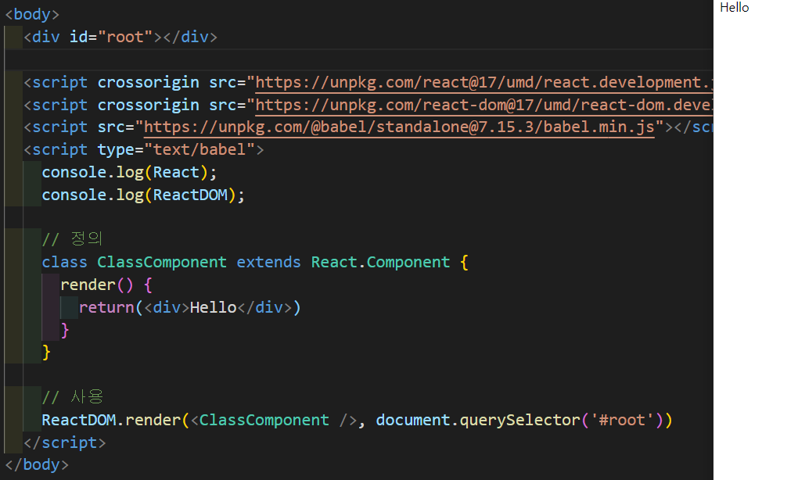
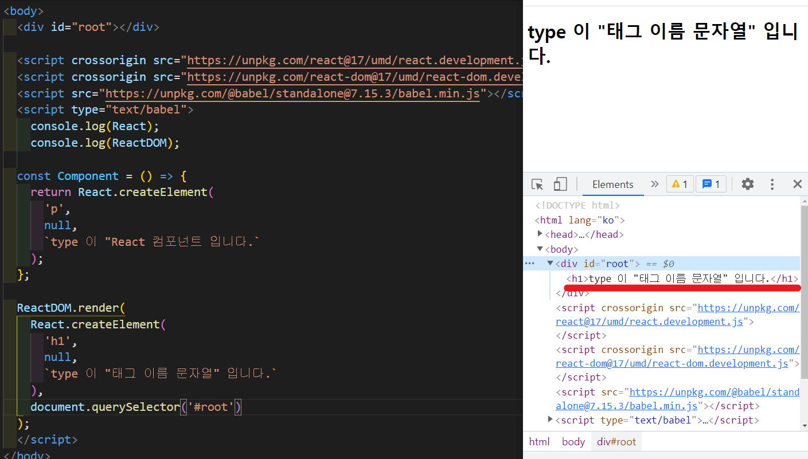
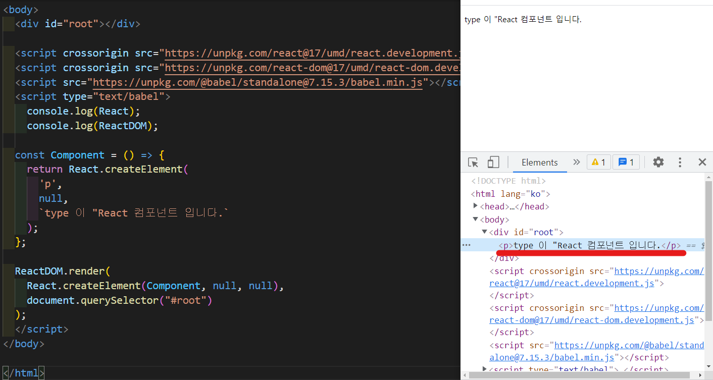
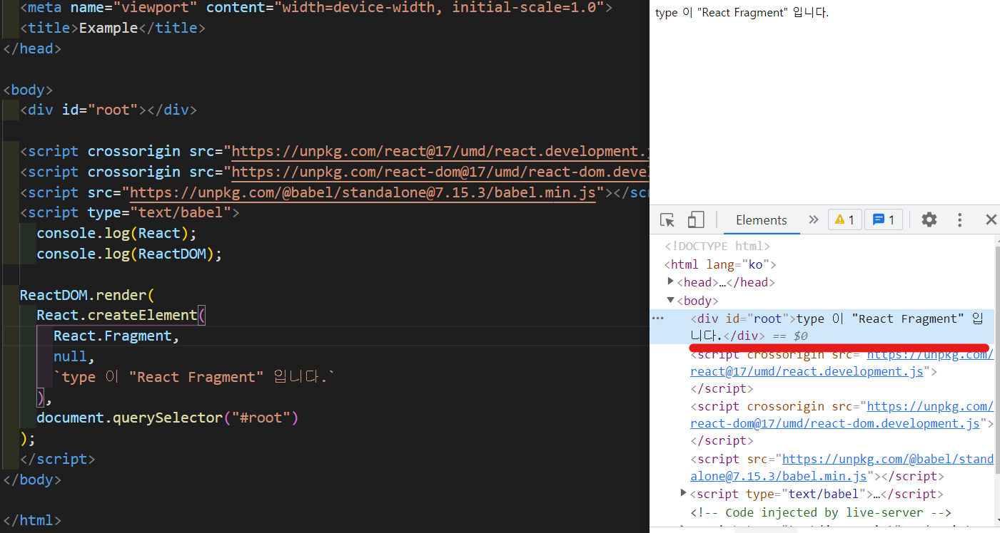
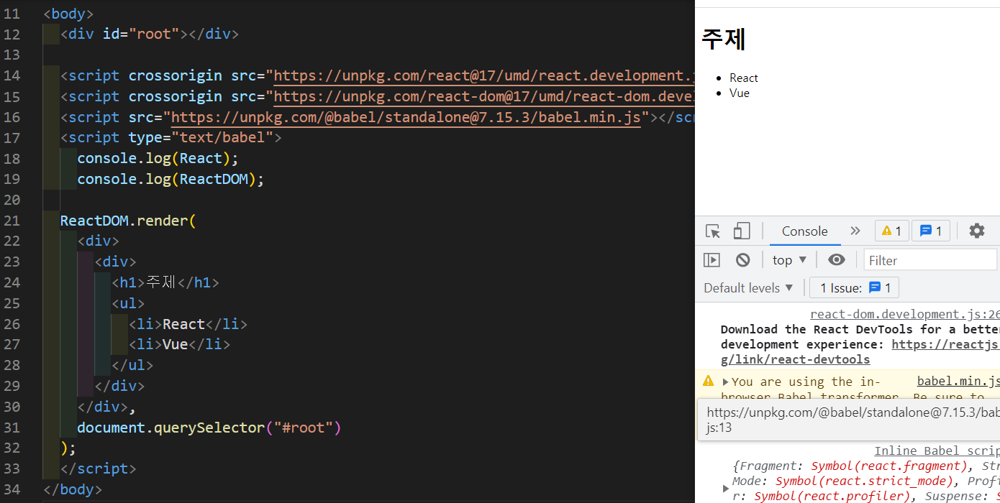

# React Component

## React Component 만드는법
- Hooks 이전

  > Hooks  
  Hooks는 React 버전 16.8부터 React 요소로 새로 추가되었다. Hooks를 이용하여 기존 Class 바탕의 코드를 작성할 필요 없이 상태 값과 여러 React의 기능을 사용할 수 있다.

  - 컴포넌트 내부에 상태가 있다면?
    - class
  - 컴포넌트 내부에 상태가 없다면?
    - 라이프사이클을 사용해야 한다면?
      - class
    - 라이프 사이클에 관계 없다면?
      - function  
  
- Hooks 이후 이전과 같은 기준을 가지고 구분해서 사용하지 않는다.
  - class
  - function

- Class 컴포넌트
  
  ```javascript
  import React from 'react';

  // 정의
  // React의 .Component 클래스를 상속받아서 구현한다
  class ClassComponent extends React.Component { 
    // render Method 정의
    render() {
      // 이 Method는 항상 return 해줘야하고 리턴되는 영역이 react.element여야 한다.
      return (<div>Hello</div>);
    }
  }
  
  // ClassComponent를 사용하면 화면에 <div>Hello</div>를 render 한다.
  
  //사용
  ReactDom.render(
    <ClassComponent />,
    document.querySelector('#root')
  );
  ```
    - 결과
    

- Function 컴포넌트
  - 사용하는 방법은 class 컴포넌트랑 같다.
  - 정의하는 방식이 function을 이용했다는 점이 차이점이다.

  ```javascript
  import React from 'react';

  // 정의 1
  // funtion은 순수한 함수이다.
  funtion FunctionComponent() {
    return <div>Hello</div>;
  }

  // 정의 2
  // Arrowfunction은 return만 있다면 중괄호와 리턴을 생략할 수 있다.
  const FunctionComponent = () => <div>Hello</div>;

  // 사용
  ReactDOM.render(
    <FunctionComponent />, 
    document.querySelector('#root')
  );

## React.createElement로 컴포넌트 만들기

- createElement에 들어가는 3개의 인자
  ```javascript
  React.createElement(
    type, // 태그 이름 문자열 or 리액트 컴포넌트 or React.Fragment
    [props], // 리액트 컴포넌트에 넣어주는 데이터 객체
    [...children] // 자식으로 넣어주는 요소들
  );
  ```
- 예제 1
  ```javascript
  // 1. 태그 이름 문자열 type
  ReactDOM.render(
    React.createElement(
      'h1', 
      null, 
      `type 이 "태그 이름 문자열" 입니다.`
    ),
    document.querySelector('#root')
  );
  ```
- 결과
  

- 예제 2
  ```javascript
  // 2. 리액트 컴포넌트 type
  const Component = () => {
    return React.createElement(
      'p', 
      null, 
      `type 이 "React 컴포넌트 입니다.`
    );
  };

  ReactDOM.render(
    React.createElement(Component, null, null),
    document.querySelector("#root")
  );
  ```

- 결과
  

- 예제 3
  ```javascript
  // 3. React.Fragment
  ReactDOM.render(
    React.createElement(
      React.Fragment,
      null,
      `type 이 "React Fragment" 입니다.`
    ),
    document.querySelector("#root")
  )
  ```

- 결과
  
  - Fragment를 사용하면 태그부분이 없이 자식요소 여러개를 바로 넣을 수 있다. (배열처럼)

- 예제 4
  ```javascript
  // 4. 복잡한 리액트 엘리먼트 모임
  // javascript의 라이브러리로 만든 코드
  ReactDOM.render(
    React.createElement(
      'div', 
      null, 
      React.createElement(
        'div', 
        null, 
        React.createElement('h1', null, '주제'),
        React.createElement(
          'ul', 
          null, React.createElement('li', null, 'React'),
          null, React.createElement('li', null, 'Vue')
        )
      )
    ),
    document.querySelector("#root")
  );
  ```
- babel
  - 크로스브라우징의 혼란을 해결해 줄 수 있는 것이다.
  - ECMAScript2015+로 작성한 코드를 모든 브라우저에서 동작하도록 호환성을 지켜준다. 타입스크립트, JSX처럼 다른 언어로 분류되는 것도 포함한다.
  - 예제4는 단순히 HTML에 자바스크립트 코드를 넣어서 브라우저에서 실행하고 있다.
  - 원래는 예제4를 트랜스파일해서 나온 결과물을 브라우저에서 실행해야 한다.
  - 예제4는 트랜스파일을 안하고 있기에 임시로 할 수 있는 방법을 소개한다.

## JSX
  - babel로 JSX 문법으로 작성된 코드를 순수한 JavaScript로 트랜스파일 하여 사용한다.
  
  - babel로 트랜스파일한 예제4 
  

  - 이러한 장점으로 JSX와 React를 선호하기 시작했다.

### JSX를 쓰는 이유
  - 가독성이 좋아서
  - babel과 같은 트랜스파일 과정에서 문법적 오류를 인지하기 쉽다.

### JSX문법
  - 최상위 요소가 하나여야한다.
  - 최상위 요소를 리턴하는 경우 소괄호로 감싸야 한다.
  - 자식들을 바로 랜더링하고 싶으면?
    - <>자식들</>을 사용한다. => Fragment
  - 자바스크립트 표현식을 사용하려면?
    - {표현식}을 사용한다.
  - if문은 사용할 수 없다.
    - 삼항 연산자 혹은 &&을 사용한다.
  - style을 이용해 인라인 스타일링이 가능하다.
  - class 대신 className을 사용해 class를 적용할 수 있다.
  - 자식요소가 있으면 꼭 닫아야하고 자식요소가 없으면 열면서 닫아야 한다.
    - <태그>예시</태그>
    - <태그 />


